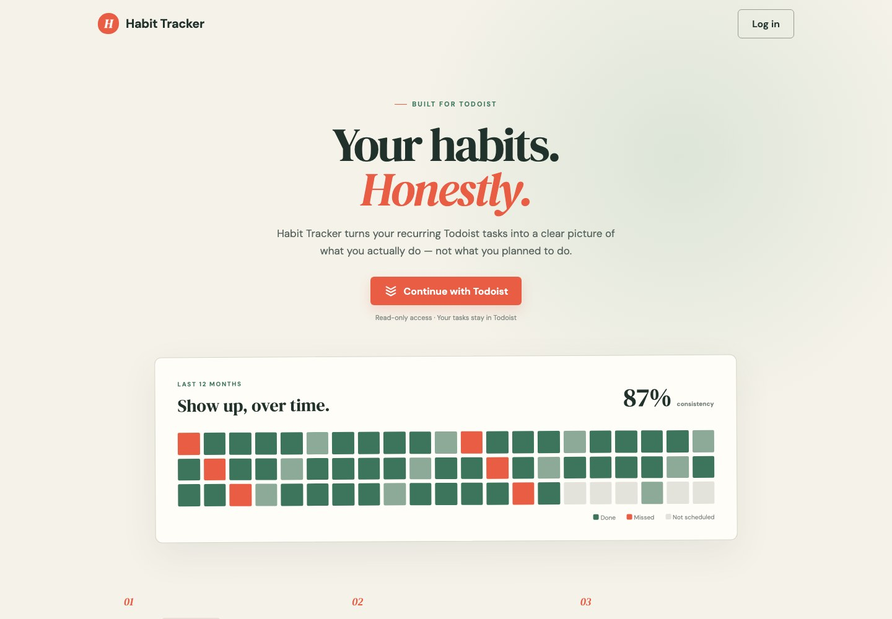
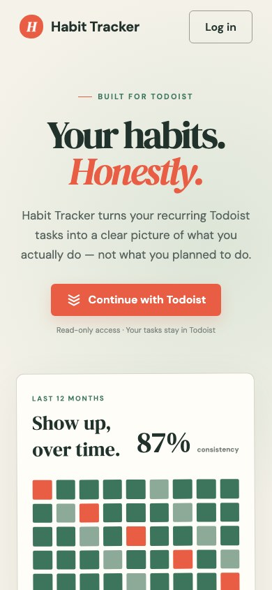

# Habit Tracker

> [!IMPORTANT]
> **This entire repository—including the application, design, tests, documentation, and deployment setup—was made with AI.**

A Todoist-powered habit dashboard that turns recurring tasks tagged `habit`
into an honest history of completed and missed periods. Habit Tracker supports
Todoist schedules as well as custom rhythms such as every two days or a target
number of completions per week.



<p align="center">
  
</p>

## Features

- Todoist OAuth with read-only `data:read` access
- Automatic discovery of active tasks tagged `habit`
- Exact 90-day all-habits summary dashboard
- Twelve-month detail views with heatmap, monthly trend, and recent history tabs
- Daily, interval, and one-to-seven-times-per-week rhythm overrides
- Completion history imported from Todoist activity
- Persistent users, sessions, habits, overrides, and completions in SQLite
- Mobile navigation and recurrence-aware responsive visualizations
- Deployment build number shown in the application and health response
- Gitea Actions pipeline publishing a Docker image for Coolify

## Run locally

Requires Node.js 22 or newer and a Todoist OAuth application.

```sh
cp .env.example .env
npm install
npm run dev
```

Set the Todoist OAuth redirect URL to:

```text
http://localhost:3000/api/auth/callback
```

Then open <http://localhost:3000>.

## Environment variables

| Variable | Required | Description |
| --- | --- | --- |
| `APP_URL` | Production | Public base URL, for example `https://habits.example.com`. |
| `TODOIST_CLIENT_ID` | Yes | Todoist OAuth application client ID. |
| `TODOIST_CLIENT_SECRET` | Yes | Todoist OAuth application client secret. |
| `AUTH_SECRET` | Recommended | Legacy JWT verification secret used during session migration. New sessions are stored in SQLite. |
| `CRON_SECRET` | Recommended | Bearer token protecting scheduled `GET /api/sync` requests. |
| `SQLITE_PATH` | No | SQLite file. Defaults to `./data/habit.db` locally and `/data/habit.db` in Docker. |
| `APP_VERSION` | No | Deployment identifier. The Gitea pipeline supplies the source commit automatically. |
| `PORT` | No | HTTP port. Defaults to `3000`. |

## Docker

Build and run the image with a persistent volume:

```sh
docker build --build-arg APP_VERSION="$(git rev-parse HEAD)" -t habit-tracker .
docker run --rm \
  --env-file .env \
  --mount type=volume,source=habit-tracker-data,target=/data \
  --publish 3000:3000 \
  habit-tracker
```

The SQLite database and its WAL files live under `/data`. Do not deploy without
that persistent mount if logins, synced history, and rhythm overrides must
survive container replacement.

## Coolify deployment

1. Create a **Docker Image** application using:
   `registry.example.com/your-account/habit-tracker:main`.
2. Expose port `3000`.
3. Configure the environment variables listed above.
4. Add native Coolify **Persistent Storage** with destination `/data`.
5. Configure the domain and Todoist callback URL:
   `https://YOUR_DOMAIN/api/auth/callback`.
6. Configure the health check as `GET /api/health` on port `3000`.
7. Keep a single replica because SQLite is a single-writer database.

The production health response includes the short deployment build:

```json
{"status":"ok","version":"8484901"}
```

For automatic imports, schedule `GET /api/sync` with:

```text
Authorization: Bearer YOUR_CRON_SECRET
```

### Gitea Container Registry

The Gitea Actions workflow installs dependencies, runs the production build,
audits production dependencies, and publishes:

```text
registry.example.com/your-account/habit-tracker
```

Every branch receives a sanitized branch tag. `main` publishes `:main` and
removes obsolete package versions. Add a repository Actions secret named
`REGISTRY_TOKEN` containing a Gitea token with package read/write permission.
The registry host and package owner are derived from the Gitea runtime context.
The workflow embeds `gitea.sha` into the image as its deployment build number.

## Data and privacy

Habit Tracker requests Todoist's read-only `data:read` scope and never modifies
tasks. Todoist access tokens, application sessions, imported completions, and
rhythm overrides are stored in the local SQLite database. Protect the persistent
volume and back it up like any other credential-bearing datastore.

Todoist's historical activity availability may depend on the user's Todoist
plan. Manual sync is available in the application; scheduled sync is protected
by `CRON_SECRET`.

## License

[MIT](LICENSE)
